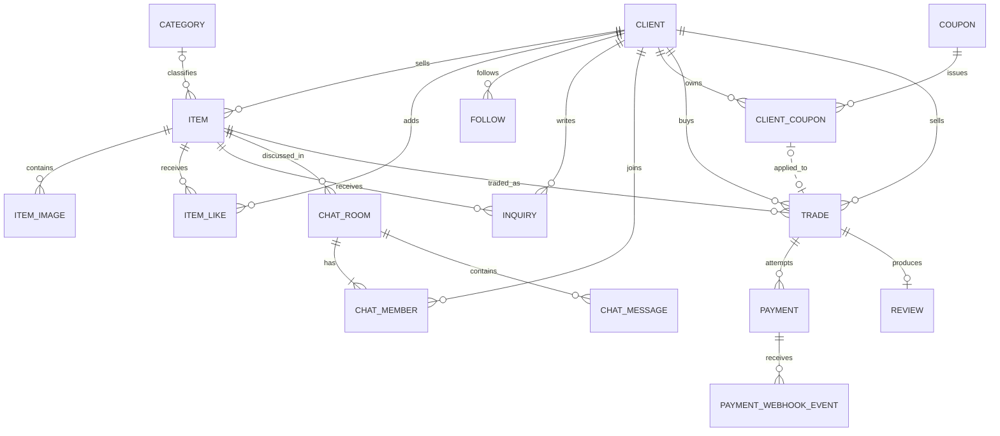

# ERD 규칙

## Entity

| 도메인 | Entity |
|---|---|
| 회원 | Client |
| 상품 | Category, Item, ItemImage, ItemLike |
| 소셜·문의 | Follow, Inquiry, Review |
| 채팅 | ChatRoom, ChatMember, ChatMessage |
| 쿠폰 | Coupon, ClientCoupon |
| 거래·결제 | Trade, Payment, PaymentWebhookEvent |

## 핵심 관계

## 키와 제약

- ItemLike PK: `(client_id, item_id)`
- Follow PK: `(follower_id, following_id)`
- ChatMember PK: `(chat_room_id, client_id)`
- ClientCoupon: `UNIQUE(coupon_id, client_id)`
- Review: `UNIQUE(trade_id)`
- Payment: `UNIQUE(merchant_uid)`, `UNIQUE(pg_payment_id)`
- PaymentWebhookEvent: `UNIQUE(event_id)`

## 삭제와 보존

| 정책 | Entity |
|---|---|
| Soft Delete `deleted_at` | Client, Item, Inquiry, Review, ChatMessage |
| Hard Delete | ItemLike, Follow, ItemImage |
| 영구 보존 | Trade, Payment, PaymentWebhookEvent |

- Soft Delete Entity의 일반 조회는 삭제된 행을 제외한다.
- `is_deleted`보다 삭제 시각을 확인할 수 있는 `deleted_at`을 사용한다.
- DB 변경은 Flyway migration과 함께 이 문서를 갱신한다.
