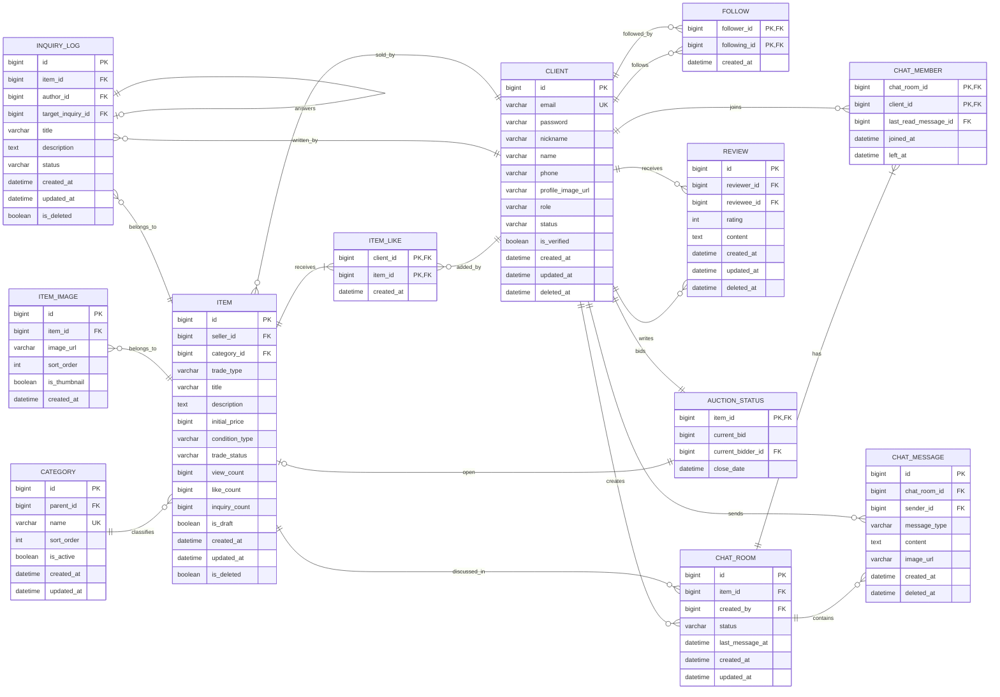

# ERD

## Mermaid

## Entity 목록

| 도메인 | Entity |
|---|---|
| 인증·회원 | Client |
| 카테고리 | Category |
| 상품 | Item, ItemImage, ItemLike, AuctionStatus |
| 문의 | InquiryLog |
| 팔로우 | Follow |
| 채팅 | ChatRoom, ChatMember, ChatMessage |
| 리뷰 | Review |

## 주요 제약

- `client.email`은 유일하다.
- `category.name`은 유일하다.
- `category.parent_id`는 `category.id`를 참조한다.
- `item.seller_id`는 `client.id`를 참조한다.
- `item.category_id`는 `category.id`를 참조한다.
- `item_like` PK는 `(client_id, item_id)`다.
- `inquiry_log.target_inquiry_id`는 답변 대상 `inquiry_log.id`를 참조한다.
- 문의 API의 `contents` 요청 필드는 `inquiry_log.description`에 저장한다.
- `follow` PK는 `(follower_id, following_id)`다.
- `chat_member` PK는 `(chat_room_id, client_id)`다.
- `auction_status.item_id`는 PK이자 `item.id` FK다.
- `auction_status.current_bidder_id`는 현재 최고 입찰자 `client.id`를 참조하며 입찰 전에는 nullable일 수 있다.

## 삭제 정책

| Entity | 정책 |
|---|---|
| Client | Soft Delete, `deleted_at` |
| Item | Soft Delete, `is_deleted` |
| InquiryLog | Soft Delete, `is_deleted` |
| ChatMessage | Soft Delete, `deleted_at` |
| Review | Soft Delete, `deleted_at` |
| ItemImage | Hard Delete |
| ItemLike | Hard Delete |
| Follow | Hard Delete |
| ChatMember | `left_at` 기록 |
| Category | `is_active` 비활성화 |
| AuctionStatus | Item 생명주기와 함께 관리 |
